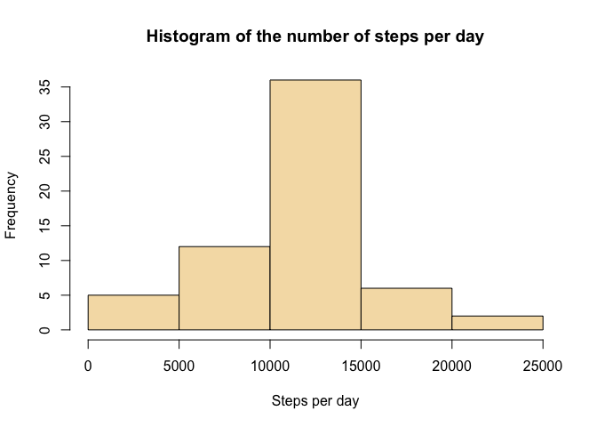

##Activity Analysis


###1.Code for reading in the dataset and processing the data
Transform date strings to date object.

```r
activity <- read.csv("activity.csv", stringsAsFactors=FALSE)
activity$date <- as.Date(activity$date, "%Y-%m-%d")
```

###2.Histogram of the total number of steps taken each day
Sum up the steps group by date and ignore NAs.

```r
steps_per_day <- aggregate(activity$steps, by=list(date=activity$date), sum, na.rm=TRUE)
hist(steps_per_day$x, xlab="Steps per day", main="Histogram of the number of steps per day", col="wheat")
```

<!-- -->

###3.Mean and median number of steps taken each day
Calculate mean and median by the summary function.

```r
summary(steps_per_day$x)
```

```
##    Min. 1st Qu.  Median    Mean 3rd Qu.    Max. 
##       0    6778   10400    9354   12810   21190
```

###4.Time series plot of the average number of steps taken
Calculate the average of steps group by interval and ignore NAs.

```r
avg_steps_per_interval <- aggregate(activity$steps, by=list(interval=activity$interval), mean, na.rm=TRUE)
with(avg_steps_per_interval, plot(interval, x, type="l", ylab="Number of steps", main="Average number of steps over one day"))
```

<!-- -->

###5.The 5-minute interval that, on average, contains the maximum number of steps

```r
avg_steps_per_interval[which.max(avg_steps_per_interval$x),]$interval
```

```
## [1] 835
```

###6.Code to describe and show a strategy for imputing missing data
Calculate the total number of missing values. (The count of TRUE)

```r
table(is.na(activity$steps))
```

```
## 
## FALSE  TRUE 
## 15264  2304
```
Use the mean for the 5-minute interval to impute the missing value.  
Apply join method from the plyr package to help with the imputation.

```r
library(plyr)
new_activity <- join(activity, avg_steps_per_interval, by="interval")
new_activity[is.na(new_activity$steps),]$steps <- new_activity[is.na(new_activity$steps),]$x
new_activity$x <- NULL
```

###7.Histogram of the total number of steps taken each day after missing values are imputed
After the missing values are imputed, the distribution becomes more symmetric.

```r
new_steps_per_day <- aggregate(new_activity$steps, by=list(date=new_activity$date), sum)
hist(new_steps_per_day$x, xlab="Steps per day", main="Histogram of the number of steps per day", col="wheat")
```

<!-- -->

Again, calculate mean and median for the imputed dataset by the summary function.  
The mean and the median are now the same.

```r
summary(new_steps_per_day$x)
```

```
##    Min. 1st Qu.  Median    Mean 3rd Qu.    Max. 
##      41    9819   10770   10770   12810   21190
```

###8.Panel plot comparing the average number of steps taken per 5-minute interval across weekdays and weekends
Add a new factor column 'weekday' to the dataset.   
Next, calculate the average of steps group by interval and weekday.  
Finally, apply lattice package to plot the time series plot of steps conditioning by weekday

```r
new_activity$weekday <- weekdays(new_activity$date)
new_activity[new_activity$weekday=="Sunday" | new_activity$weekday=="Saturday",]$weekday <- "weekend"
new_activity[new_activity$weekday!="weekend",]$weekday <- "weekday"
new_activity$weekday <- as.factor(new_activity$weekday)

new_avg_steps_per_interval <- aggregate(new_activity$steps, by=list(interval=new_activity$interval, weekday=new_activity$weekday), mean)

library(lattice)
xyplot(x ~ interval | weekday, data=new_avg_steps_per_interval, layout=c(1,2), type="l", xlab="Inteval", ylab="Number of steps")
```

<!-- -->
